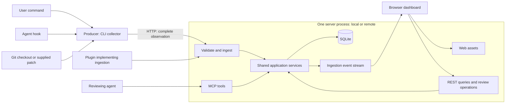
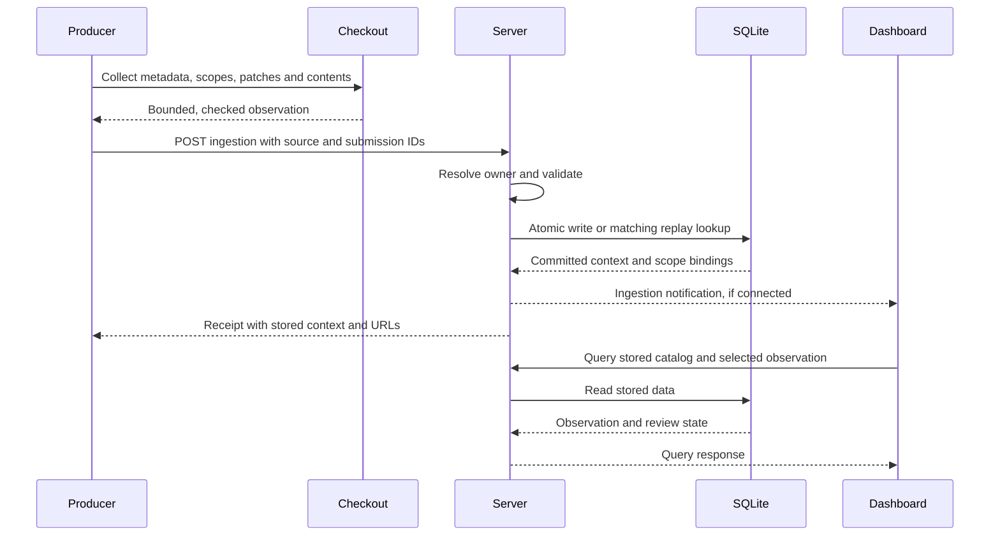

# System design

servediff collects Git changes at the producer and pushes complete observations
to a server. The server validates and stores those observations, then serves
them through REST, MCP and a web dashboard. Queries read stored state; they never
ask a producer to inspect a checkout.

This document records the implemented design and its decisions. See
[architecture.md](architecture.md) for package boundaries,
[the README](../README.md) for commands and [the OpenAPI contract](../packages/api/openapi.yaml)
for transport details. Future extensions below are not implemented guarantees.

## Terminology and ownership

| Term                | Meaning and responsibility                                                                                                                          |
| ------------------- | --------------------------------------------------------------------------------------------------------------------------------------------------- |
| Producer            | Code with access to a checkout or supplied patch. Collects data, attaches provenance and submits it.                                                |
| Collector           | The shared Git-aware collection pipeline used by manual CLI commands and agent hooks.                                                               |
| Plugin / agent hook | An event-triggered producer. Can invoke the CLI or implement the ingestion contract directly.                                                       |
| Server / daemon     | One process owning ingestion, application processing, SQLite, REST, MCP and web assets. A local daemon is the background deployment of this server. |
| Observation         | One immutable submission: captured metadata, diff scopes, patches and available file contents.                                                      |
| Context             | The server-assigned address for reviewing an observation, including its review state.                                                               |
| Source              | A producer installation or explicitly identified container. Distinct from a repository, branch or hostname.                                         |
| Checkout            | A source-specific Git working directory or linked worktree. Owned by the producer.                                                                  |
| Account / owner     | The server-established identity that owns stored observations and review state.                                                                     |

The CLI owns argument parsing, collection, transport and local lifecycle
bootstrap. The server owns the catalog and its interpretation. The CLI does not
register paths for later server collection or maintain its own catalog.

## Processes and deployment

There is **one long-running server process per deployment**. Collection commands
and hook invocations are short-lived. There is no watcher or collector daemon.

Two server entry points compose the same application logic:

- **Local:** `servediff service start` runs the per-user background server.
  Local `review` and `pipe` start it automatically when needed.
- **Remote:** `servediff-server` runs in the foreground. A hosting environment
  manages its lifetime, persistent storage and TLS termination.

These are separate applications in the monorepo, not two required processes on
each machine. A producer selects a local or remote destination. Both deployments
may exist simultaneously; neither requires the other, and there is no automatic
local-to-remote relay.



Local discovery and lifecycle use a separate authenticated loopback control
listener inside the same process. Local CLI submissions use this private HTTP
adapter; direct plugins and remote collectors use `POST /api/v2/ingestions`.
Both adapters call the same ingestion operation. REST and MCP call application
services directly rather than calling each other over HTTP.

## Request and response flows

### Collect and ingest

`servediff review` collects the current directory; `review --path PATH` selects
another checkout. An agent hook runs the same operation with
`--trigger agent-hook`, optionally supplying agent, run and source identity.
The trigger changes provenance and browser-opening behavior, not the ingestion
model. `servediff pipe` submits an explicit patch from stdin, with optional Git
provenance from its directory.

1. The producer captures metadata and complete diff data before submission.
   Git reviews contain all, staged and unstaged scopes. Piped patches contain
   only the all scope and do not supply full file contents.
2. Collection checks for concurrent checkout changes and uses bounded retries
   and deadlines. Collection failure is reported. A successfully collected
   empty diff is a valid observation, not an error placeholder.
3. For local submission, the CLI discovers or starts the server. An explicit
   remote destination skips local service bootstrap.
4. The producer sends the versioned request, submission ID, metadata and scopes.
   The server establishes the owner, validates the request and checks replay
   identity.
5. One SQLite transaction stores the observation, scope manifests, patches,
   available contents, review bindings and replay identity. No partially stored
   observation becomes visible.
6. After commit, the application emits an ingestion notification. The public
   endpoint returns HTTP 200 with the context ID, review URL, MCP URL and stored
   all-scope snapshot. The local adapter returns the equivalent application
   result; the CLI prints URLs and optionally opens the browser.
7. The producer exits. The server continues serving the committed data even
   after the producer or checkout disappears.



### Browse and review

The dashboard queries `/api/v2/contexts`, selects a repository, then selects an
observation identified by worktree, branch, source, run and time. Distinct
content from the same worktree remains independently selectable; unchanged
reviews reuse one context. Search supports repository, branch, worktree,
hostname, source and run metadata. Filters cover Availability, Host, Changes,
Branch and Worktree, with OR within a multi-select filter and AND across
filters. Filtering precedes repository grouping and counts. Available is the
default; unavailable legacy entries are disabled and skipped by keyboard
navigation. Selections persist while navigating the picker.

Opening a context or switching scope loads its stored manifest, patches and
available contents through scoped REST endpoints. MCP uses the same stored
context and review services. Comments and reviewed marks are mutable SQLite
state bound to the observation and scope; the captured diff stays immutable.

`GET /api/v2/events` supplies transient server-sent ingestion notifications.
The browser reloads the catalog on events and reconnection. An arrival does not
silently replace the observation being reviewed. The event stream is a hint to
query durable state, not a durable queue or an event replay log.

## Data and identity

The conceptual model is:

```text
account
  repository grouping
    observations from any number of sources and checkouts
      captured metadata
      immutable scopes: all / staged / unstaged
        manifest, patches, available contents
        mutable review state
```

An observation can also be unassociated with a repository, such as a standalone
piped patch. Server-assigned context, diff and version IDs identify stored
records; producer paths do not identify server files.

| Identity or metadata | Current meaning                                                                                                                                                                                                |
| -------------------- | -------------------------------------------------------------------------------------------------------------------------------------------------------------------------------------------------------------- |
| Account              | Established by local or remote server composition; never accepted as an arbitrary producer claim.                                                                                                              |
| Repository key       | Grouping hint derived from the sanitized Git remote URL when available; otherwise from source identity and Git common directory. Equivalent repositories with different remote URL forms may group separately. |
| Source ID            | Stable local producer identity, or explicit `--source-id` for a container/installation. Hostname is a searchable label, not this identity.                                                                     |
| Checkout key         | Derived from source ID and Git directory, distinguishing linked worktrees and independent sources.                                                                                                             |
| Submission ID        | Identifies one collection and survives retries. A new collection gets a new ID.                                                                                                                                |
| Provenance           | Repository name, remote URL, path, worktree name, branch, HEAD, hostname, agent, run, trigger, collection time and collector version.                                                                          |
| Stored time          | Server timestamp used for catalog ordering; separate from the producer's collection timestamp.                                                                                                                 |

The account boundary allows future authenticated users to receive observations
from many containers, including identical branch and path names. Source, run
and checkout metadata preserve their differences. Provenance describes what a
producer reported; it is not proof of repository ownership or trustworthiness.

SQLite is the durable query source, including the diff data itself. Reads need
neither Git nor a repository mount. Available full contents are captured within
a collection budget; unsupported or unavailable previews remain explicit.
Snapshots expire seven days after the last fresh submission. Reads enforce
expiry immediately; local and remote servers prune at startup and hourly,
removing all scopes, previews, comments, marks and retry mappings. Schema
migration preserves existing histories and sets expiry from their last
submission times. Existing duplicates remain until expiry. Legacy registered
worktree contexts cannot trigger server Git reads; users submit a new review.

## Decisions and trade-offs

| Decision                                                     | Reason and consequence                                                                                                                                       |
| ------------------------------------------------------------ | ------------------------------------------------------------------------------------------------------------------------------------------------------------ |
| Push-only freshness                                          | Queries have predictable dependencies and work after checkout removal. Missing producer events or failed uploads can leave the catalog behind the checkout.  |
| Complete observations, not path registration or change pings | The same contract works across machines and containers. Producers pay collection and upload costs; the server never needs producer filesystem access.        |
| Shared pipeline for hooks and manual commands                | Both paths produce the same searchable metadata and reviewable data. No separate plugin-specific storage model.                                              |
| Immutable snapshots with seven-day retention                 | Reused contexts keep their original contents and review state; fresh submissions reset expiry. Expiry removes comments and reviewed marks too.               |
| Dedupe matching checkout content                             | Stable hashes reuse unchanged reviews within one account/source/checkout/branch/HEAD. Independent sources and different contents remain separate.            |
| Synchronous atomic ingestion                                 | A successful receipt means publication is committed, not merely queued. Upload latency includes validation and persistence.                                  |
| One server process, layered entry points                     | Local use stays simple; remote deployment adds authentication around shared logic. This is not a distributed worker system.                                  |
| SQLite first                                                 | Durable queries and transactions with a small operational footprint. Other storage and queue backends remain future implementation work.                     |
| Event notifications plus catalog queries                     | The database remains authoritative when a connection drops. Notifications may be missed or repeated.                                                         |
| No watcher                                                   | Explicit CLI calls and agent events are the only new collection triggers. There is no filesystem polling, Git-hook installer or background freshness repair. |

“Latest” means the latest stored observations received by the server. It does
not mean verified current checkout state or a single authoritative diff for a
branch. Producer collection clocks and submission arrival order can differ.
The API does not contact producers to establish freshness.

### Failure and retry semantics

Replay identity is **account + source ID + submission ID**. The server hashes
the validated request representation. A matching replay returns the original
context; different content under the same identity fails with a conflict.
A separate identity uses account, source, repository, checkout, branch, HEAD,
source kind, scopes and producer content hash to reuse unexpired snapshots.
The hash covers full content before preview truncation, including binary and
untracked files, modes, renames and staged/unstaged state; mtime and ctime are
excluded. Unsupported full identities fail closed and remain independent.
Producers without a hash dedupe only known empty snapshots. Fresh matching
submissions retain separate retry mappings and provenance, refresh catalog
recency and reset expiry without replacing the original snapshot or review.

The CLI performs a bounded retry of the exact collected request after an
eligible transport failure. It does not recollect the checkout during that
retry. A lost response can mean the transaction committed; replay resolves that
uncertainty without creating a second observation. Validation and conflicting
requests fail explicitly rather than being retried as transport errors.

There is no durable producer outbox, offline upload queue or guarantee that an
agent hook will run. Producers report failures. Direct plugins implementing the
contract must preserve submission identity themselves when retrying. A later
manual collection has a new submission ID and may reuse matching content; it
is not a replay of a previous failed submission.

## Local and remote boundaries

Local service discovery, process lifetime locks and database ownership belong
to the local adapter. Persisted service settings default to
`~/.config/servediff/config.json`; service config commands update them and
start/restart `--config` overrides apply to that invocation. These settings do
not constitute a catalog of producer checkouts.

The local public API uses the existing local trust model and is unauthenticated.
It binds to loopback by default. Exposing that listener exposes its data to
reachable clients; the private control token protects lifecycle operations,
not public REST/MCP/web access.

The remote entry point currently serves one configured account with SQLite.
It requires a token, accepts bearer authentication for producer/API/MCP clients
and HTTP Basic for browser access. Deployments supply TLS and a persistent
database volume. Multi-account authentication is not implemented yet.

A container producer needs the collector, Git and checkout access only for the
duration of collection. It can submit directly to a remote server without a
background servediff process. A local server inside a container can instead
run under its process supervisor. The ingestion architecture supports both;
container packaging and hook integration are separate deployment work.

## Extension direction

Keep checkout access on the producer side and owner resolution on the server
side. Remote authentication, storage adapters and queue infrastructure can be
added at server composition boundaries while preserving the shared application
operations and versioned ingestion contract.

Future multi-user auth must derive ownership from authenticated credentials.
Future precedence can query retained submission metadata without discarding
independent source identities. Future
storage backends must preserve atomic publication and replay identity. A future
queue must distinguish accepted work from committed, queryable observations
rather than silently weakening the existing receipt semantics.

Trigger selection, durable producer retries, configurable retention, multi-user auth,
alternative storage, queues and any upstream relay remain open extensions.
They are not hidden background behavior in the current system.
